# 「不揪ㄛ」揪團平台——資料庫設計文件 (Database Design)

本文件詳細定義「不揪喔」運動與麻將揪團平台的資料庫結構設計，對齊專案最新版本之 Django Models 實作。包含完整實體關係圖 (ERD)、各資料表架構 (Schema) 詳解、索引約束與外鍵級聯規則。

---

## 一、 實體關係圖 (Entity-Relationship Diagram)

以下為本平台資料表的關聯網絡圖，使用 Mermaid 語法繪製：

```mermaid
erDiagram
    users {
        int user_id PK "AUTO_INCREMENT"
        varchar email UK "電子信箱"
        varchar password "密碼"
        varchar name "姓名/暱稱"
        int credit_point "信譽點數 (預設 100)"
        varchar phone UK "電話號碼"
        date birth_date "生日"
        varchar gender "性別"
        varchar avatar_url "頭像網址"
        text bio "個人簡介"
        varchar line_id "LINE ID"
        varchar instagram "Instagram ID"
        timestamp last_credit_update "最後信譽更新時間"
        varchar role "角色 ('user', 'admin')"
    }
    user_sport_levels {
        int id PK "AUTO_INCREMENT"
        int user_id FK "使用者 ID"
        int sport_id FK "運動 ID"
        varchar level "程度 ('C', 'B', 'A', 'S')"
        timestamp updated_at "更新時間"
    }
    sports {
        int sport_id PK "AUTO_INCREMENT"
        varchar sport_name UK "運動名稱"
    }
    taiwan_regions {
        varchar zipcode PK "郵遞區號"
        varchar city "縣市"
        varchar district "行政區"
    }
    address {
        int address_id PK "AUTO_INCREMENT"
        varchar zipcode FK "郵遞區號"
        varchar street_line "道路與門牌"
    }
    venues {
        int venue_id PK "AUTO_INCREMENT"
        int address_id FK "地址 ID"
        varchar name "場館名稱"
        json opening_hours "營業時間"
    }
    facilities {
        int facility_id PK "AUTO_INCREMENT"
        varchar name UK "設施名稱"
    }
    venue_facilities {
        int venue_id PK, FK "場館 ID"
        int facility_id PK, FK "設施 ID"
    }
    court {
        int court_id PK "AUTO_INCREMENT"
        int venue_id FK "場館 ID"
        tinyint occupied "是否佔用"
        int base_price "球場基本租借費用"
    }
    court_conflicts {
        int conflict_id PK "AUTO_INCREMENT"
        int court_id_1 FK "互斥球場 1"
        int court_id_2 FK "互斥球場 2"
    }
    court_sports {
        int court_id PK, FK "場地 ID"
        int sport_id PK, FK "支援運動 ID"
    }
    gamesmatches {
        int game_id PK "AUTO_INCREMENT"
        varchar game_name "比賽/活動名稱"
        int user_id FK "主揪 ID"
        int sport_id FK "運動項目 ID"
        int court_id FK "球場 ID"
        int least_players "最少成團人數"
        int most_players "最大人數上限"
        varchar target_level "要求程度 ('休閒', '業餘', '高手')"
        date booking_date "活動日期"
        varchar time_slot "活動時段"
        decimal total_price "場地總價"
        tinyint deposit_required "是否需要訂金"
        timestamp cancel_deadline "免費取消期限"
        varchar match_status "狀態 ('recruiting', 'full', 'started', 'closed', 'failed_to_start')"
        json weather "天氣資訊"
        int air_index "AQI 空氣品質指數"
        varchar booking_status "預約狀態 ('已佔到/已預約', '未佔到/未預約', '未確認')"
        text game_note "備註說明"
        varchar gender_limit "性別限制 ('不限', '限男', '限女')"
    }
    keep {
        int id PK "AUTO_INCREMENT"
        int user_id FK "收藏者 ID"
        int game_id FK "球局 ID"
    }
    match_participants {
        int list_id PK "AUTO_INCREMENT"
        int game_id FK "球局 ID"
        int user_id FK "參戰球友 ID"
        timestamp joined_at "加入時間"
    }
    notification {
        int notification_id PK "AUTO_INCREMENT"
        int user_id FK "通知對象 ID"
        int game_id FK "球局 ID"
        text message "通知內容"
        tinyint is_read "是否已讀"
        timestamp created_at "建立時間"
    }
    reports {
        int report_id PK "AUTO_INCREMENT"
        int reporter_id FK "檢舉人 ID"
        int offender_id FK "被檢舉人 ID"
        int game_id FK "關聯球局 ID"
        int rule_id FK "對應規則 ID"
        text detail "詳細描述"
        text admin_note "管理員審核備註"
        timestamp reviewed_at "審核時間"
        int reviewed_by FK "審核管理員 ID"
        varchar status "審核狀態 ('pending', 'deducted', 'rejected')"
    }
    penalty_rules {
        int rule_id PK "AUTO_INCREMENT"
        varchar reason UK "違規原因"
        int points_deducted "扣除信譽分數值"
    }
    blacklist {
        int blacklist_id PK "AUTO_INCREMENT"
        int user_id FK "使用者 ID"
        timestamp added_at "封鎖時間"
        timestamp removed_at "解封時間"
    }
    feedbacks {
        int feedback_id PK "AUTO_INCREMENT"
        int user_id FK "提交者 ID"
        int feedback_type_id FK "回饋類型 ID"
        text content "內容"
        tinyint is_handled "是否已處理"
        text admin_reply "管理員回覆"
        timestamp created_at "建立時間"
    }
    feedback_types {
        int id PK "AUTO_INCREMENT"
        varchar name "回饋類型名稱"
    }
    announcements {
        int announcement_id PK "AUTO_INCREMENT"
        varchar title "公告標題"
        text content "公告內容"
        json photo "照片清單"
        timestamp created_at "建立時間"
    }
    game_bulletins {
        int bulletin_id PK "AUTO_INCREMENT"
        int game_id FK "球局 ID"
        varchar title "公告標題"
        text content "公告內容"
        timestamp created_at "建立時間"
    }

    users ||--o{ user_sport_levels : "設定運動能力"
    sports ||--o{ user_sport_levels : "定義分級項目"
    taiwan_regions ||--o{ address : "解析行政區"
    address ||--o{ venues : "擁有物理地址"
    venues ||--o{ venue_facilities : "具備設施"
    facilities ||--o{ venue_facilities : "關聯設施表"
    venues ||--o{ court : "劃分獨立場地"
    court ||--o{ court_conflicts : "涉及衝突 1"
    court ||--o{ court_conflicts : "涉及衝突 2"
    court ||--o{ court_sports : "具備支援項目"
    sports ||--o{ court_sports : "關聯運動項目"
    users ||--o{ gamesmatches : "發起/創建球局"
    sports ||--o{ gamesmatches : "屬於指定活動"
    court ||--o{ gamesmatches : "佔用實體場地"
    users ||--o{ keep : "收藏球局"
    gamesmatches ||--o{ keep : "被收藏"
    gamesmatches ||--o{ match_participants : "招募隊員(正式與候補)"
    users ||--o{ match_participants : "報名加一"
    users ||--o{ notification : "接收通知"
    gamesmatches ||--o{ notification : "產生通知背景"
    users ||--o{ reports : "發起檢舉"
    users ||--o{ reports : "被指控違規"
    users ||--o{ reports : "審理管理員"
    gamesmatches ||--o{ reports : "產生糾紛背景"
    penalty_rules ||--o{ reports : "適用處罰條款"
    users ||--o{ blacklist : "被寫入封鎖名單"
    users ||--o{ feedbacks : "提交回饋"
    feedback_types ||--o{ feedbacks : "屬於"
    gamesmatches ||--o{ game_bulletins : "發布公佈欄公告"
```

---

## 二、 資料表 Schema 詳解

### 1. `users` (使用者與管理員帳號表)
* 儲存平台所有使用者與管理員的基本資料、聯絡電話、生日及累計信譽積分。

| 欄位名稱 | 資料型態 | 允許空值 | 預設值 | 備註 / 約束 |
| :--- | :--- | :--- | :--- | :--- |
| `user_id` | `int` | 否 | *AUTO_INCREMENT* | 主鍵 (PK) |
| `email` | `varchar(255)` | 否 | | 唯一鍵 (UK)，登入帳號 |
| `password` | `varchar(255)` | 否 | | 加密後密碼 |
| `name` | `varchar(100)` | 否 | | 姓名或暱稱 |
| `phone` | `varchar(20)` | 是 | `NULL` | 手機號碼，唯一限制鍵 (UK) |
| `birth_date` | `date` | 是 | `NULL` | 用戶生日，供年齡計算 |
| `credit_point` | `int` | 否 | `100` | 信用積分 (0 ~ 100) |
| `role` | `varchar(10)` | 否 | `'user'` | 權限身分 ('user', 'admin') |
| `gender` | `varchar(10)` | 是 | `NULL` | 性別 |
| `avatar_url` | `varchar(255)` | 是 | `NULL` | 頭像網址 |
| `bio` | `text` | 是 | `NULL` | 個人簡介 |
| `line_id` | `varchar(50)` | 是 | `NULL` | LINE ID |
| `instagram` | `varchar(50)` | 是 | `NULL` | Instagram 帳號 |
| `last_credit_update` | `timestamp` | 否 | *CURRENT_TIMESTAMP* | 最後信譽恢復計算時間 |

---

### 2. `user_sport_levels` (使用者運動等級分級表)
* 紀錄使用者在不同運動項目下的程度分級，用以媒合實力相近的球友。

| 欄位名稱 | 資料型態 | 允許空值 | 預設值 | 備註 / 約束 |
| :--- | :--- | :--- | :--- | :--- |
| `id` | `int` | 否 | *AUTO_INCREMENT* | 主鍵 (PK) |
| `user_id` | `int` | 否 | | 外鍵 (FK) 連接 `users.user_id` (CASCADE) |
| `sport_id` | `int` | 否 | | 外鍵 (FK) 連接 `sports.sport_id` (CASCADE) |
| `level` | `varchar(20)` | 否 | | 程度 ('C', 'B', 'A', 'S') |
| `updated_at` | `timestamp` | 否 | *CURRENT_TIMESTAMP* | 最後修改時間 |

---

### 3. `sports` (支援運動項目表)
* 平台支援之核心活動類別定義（如籃球、羽球、排球等）。

| 欄位名稱 | 資料型態 | 允許空值 | 預設值 | 備註 / 約束 |
| :--- | :--- | :--- | :--- | :--- |
| `sport_id` | `int` | 否 | *AUTO_INCREMENT* | 主鍵 (PK) |
| `sport_name` | `varchar(100)` | 否 | | 唯一鍵 (UK)，運動名稱 |

---

### 4. `taiwan_regions` (台灣行政區對照表)
* 儲存台灣縣市、行政區及其對應之郵遞區號。

| 欄位名稱 | 資料型態 | 允許空值 | 預設值 | 備註 / 約束 |
| :--- | :--- | :--- | :--- | :--- |
| `zipcode` | `varchar(5)` | 否 | | 主鍵 (PK)，郵遞區號 |
| `city` | `varchar(50)` | 否 | | 縣市 (如：台北市) |
| `district` | `varchar(50)` | 否 | | 行政區 (如：大安區) |

---

### 5. `address` (場館物理地址表)
* 場館的定位與物理地址解析，細分郵遞區號。

| 欄位名稱 | 資料型態 | 允許空值 | 預設值 | 備註 / 約束 |
| :--- | :--- | :--- | :--- | :--- |
| `address_id` | `int` | 否 | *AUTO_INCREMENT* | 主鍵 (PK) |
| `zipcode` | `varchar(5)` | 是 | `NULL` | 外鍵 (FK) 連接 `taiwan_regions.zipcode` (SET_NULL) |
| `street_line` | `varchar(255)` | 否 | | 道路與門牌詳細資訊 |

---

### 6. `venues` (場館與球館表)
* 儲存各大型運動場館（如國民運動中心、球館）的基本資訊與營業時間。

| 欄位名稱 | 資料型態 | 允許空值 | 預設值 | 備註 / 約束 |
| :--- | :--- | :--- | :--- | :--- |
| `venue_id` | `int` | 否 | *AUTO_INCREMENT* | 主鍵 (PK) |
| `address_id` | `int` | 否 | | 外鍵 (FK) 連接 `address.address_id` (CASCADE) |
| `name` | `varchar(100)` | 否 | | 場館或球館名稱 |
| `opening_hours` | `json` | 是 | `NULL` | 營業時間範圍 JSON |

---

### 7. `facilities` (公共設施定義表)
* 平台支援之場地硬體設施主檔（如：淋浴間、停車場、冷氣等）。

| 欄位名稱 | 資料型態 | 允許空值 | 預設值 | 備註 / 約束 |
| :--- | :--- | :--- | :--- | :--- |
| `facility_id` | `int` | 否 | *AUTO_INCREMENT* | 主鍵 (PK) |
| `name` | `varchar(50)` | 否 | | 唯一鍵 (UK)，設施名稱 |

---

### 8. `venue_facilities` (場館設施多對多關係表)
* 連接 `venues` 與 `facilities` 表，標記各場館擁有之設施。

| 欄位名稱 | 資料型態 | 允許空值 | 預設值 | 備註 / 約束 |
| :--- | :--- | :--- | :--- | :--- |
| `venue_id` | `int` | 否 | | 複合主鍵之一 & 外鍵 (FK) 連接 `venues.venue_id` (CASCADE) |
| `facility_id` | `int` | 否 | | 複合主鍵之二 & 外鍵 (FK) 連接 `facilities.facility_id` (CASCADE) |

---

### 9. `court` (場館內實體場地表)
* 代表一個場館內複數的實體球場（如桌次、場地）並記錄其基本費用與支援運動。

| 欄位名稱 | 資料型態 | 允許空值 | 預設值 | 備註 / 約束 |
| :--- | :--- | :--- | :--- | :--- |
| `court_id` | `int` | 否 | *AUTO_INCREMENT* | 主鍵 (PK) |
| `venue_id` | `int` | 否 | | 外鍵 (FK) 連接 `venues.venue_id` (CASCADE) |
| `occupied` | `tinyint(1)` | 否 | `0` | 是否有實體佔用中 |
| `base_price` | `int` | 否 | `0` | 該場地基本預約費用 |

---

### 10. `court_conflicts` (場地衝突與共用互斥表)
* 解決實體球場共用邊界或租借互斥的邏輯。

| 欄位名稱 | 資料型態 | 允許空值 | 預設值 | 備註 / 約束 |
| :--- | :--- | :--- | :--- | :--- |
| `conflict_id` | `int` | 否 | *AUTO_INCREMENT* | 主鍵 (PK) |
| `court_id_1` | `int` | 否 | | 外鍵 (FK) 連接 `court.court_id` (CASCADE) |
| `court_id_2` | `int` | 否 | | 外鍵 (FK) 連接 `court.court_id` (CASCADE) |

---

### 11. `court_sports` (場地支援項目表)
* 定義特定場地所能提供的運動類型（如羽網球場同時支援羽球與網球）。

| 欄位名稱 | 資料型態 | 允許空值 | 預設值 | 備註 / 約束 |
| :--- | :--- | :--- | :--- | :--- |
| `court_id` | `int` | 否 | | 複合主鍵之一 & 外鍵 (FK) 連接 `court.court_id` (CASCADE) |
| `sport_id` | `int` | 否 | | 複合主鍵之二 & 外鍵 (FK) 連接 `sports.sport_id` (CASCADE) |

---

### 12. `gamesmatches` (揪團房間表)
* 揪團核心商務主表，記錄發起球局（或活動局）、時間段、所需人數、費用、取消期限、與氣象環境參數。

| 欄位名稱 | 資料型態 | 允許空值 | 預設值 | 備註 / 約束 |
| :--- | :--- | :--- | :--- | :--- |
| `game_id` | `int` | 否 | *AUTO_INCREMENT* | 主鍵 (PK) |
| `game_name` | `varchar(100)` | 否 | `'未命名球局'` | 球局/房間名稱 |
| `user_id` | `int` | 否 | | 主揪用戶，外鍵 (FK) 連接 `users.user_id` (CASCADE) |
| `sport_id` | `int` | 否 | | 運動類型，外鍵 (FK) 連接 `sports.sport_id` (CASCADE) |
| `court_id` | `int` | 否 | `1` | 實體場地，外鍵 (FK) 連接 `court.court_id` (CASCADE) |
| `least_players`| `int` | 否 | `1` | 最少成團人數門檻 |
| `most_players` | `int` | 否 | | 房間上限人數 |
| `target_level` | `varchar(20)` | 否 | | 開房程度限制 ('休閒', '業餘', '高手') |
| `booking_date` | `date` | 否 | | 球局活動日期 |
| `time_slot` | `varchar(100)` | 否 | | 活動時段 (如：'14:00-16:00') |
| `total_price` | `decimal(10,2)`| 否 | | 場地總價 |
| `deposit_required`| `tinyint(1)`| 否 | `0` | 逾期取消是否扣收訂金 |
| `cancel_deadline`| `timestamp` | 否 | | 免費取消截止時間 |
| `match_status` | `varchar(20)` | 否 | `'recruiting'`| 球局狀態 ('recruiting', 'full', 'started', 'closed', 'failed_to_start') |
| `weather` | `json` | 是 | `NULL`| 天氣資訊 |
| `air_index` | `int` | 是 | `NULL`| 空氣品質 AQI 指數 |
| `booking_status`| `varchar(20)` | 否 | `'未確認'` | 訂場與回報狀態 ('已佔到/已預約', '未佔到/未預約', '未確認') |
| `game_note` | `text` | 是 | `NULL` | 備註備忘 |
| `gender_limit` | `varchar(20)` | 否 | `'不限'` | 性別限制 ('不限', '限男', '限女') |

---

### 13. `keep` (球友收藏球局表)
* 多對多關係表，儲存使用者對特定進行中揪團活動的收藏。

| 欄位名稱 | 資料型態 | 允許空值 | 預設值 | 備註 / 約束 |
| :--- | :--- | :--- | :--- | :--- |
| `id` | `int` | 否 | *AUTO_INCREMENT* | 主鍵 (PK) |
| `user_id` | `int` | 否 | | 外鍵 (FK) 連接 `users.user_id` (CASCADE) |
| `game_id` | `int` | 否 | | 外鍵 (FK) 連接 `gamesmatches.game_id` (CASCADE) |

---

### 14. `match_participants` (球局正式參與與候補成員表)
* 紀錄報名此球局之球友清單。系統**無獨立候補表**，而是根據 `joined_at` 排序。
* 若加入順位排在第 `most_players` 位之後，則自動為候補成員。

| 欄位名稱 | 資料型態 | 允許空值 | 預設值 | 備註 / 約束 |
| :--- | :--- | :--- | :--- | :--- |
| `list_id` | `int` | 否 | *AUTO_INCREMENT* | 主鍵 (PK) |
| `game_id` | `int` | 否 | | 外鍵 (FK) 連接 `gamesmatches.game_id` (CASCADE) |
| `user_id` | `int` | 否 | | 外鍵 (FK) 連接 `users.user_id` (CASCADE) |
| `joined_at` | `timestamp` | 否 | *CURRENT_TIMESTAMP* | 加入時間戳 |

*註：`game_id` 與 `user_id` 設有聯合唯一索引 (Unique Index)，嚴禁重複報名。*

---

### 15. `notification` (通知紀錄表)
* 儲存發送給各使用者的系統通知訊息。

| 欄位名稱 | 資料型態 | 允許空值 | 預設值 | 備註 / 約束 |
| :--- | :--- | :--- | :--- | :--- |
| `notification_id` | `int` | 否 | *AUTO_INCREMENT* | 主鍵 (PK) |
| `user_id` | `int` | 否 | | 外鍵 (FK) 連接 `users.user_id` (CASCADE) |
| `game_id` | `int` | 是 | `NULL` | 外鍵 (FK) 連接 `gamesmatches.game_id` (CASCADE) |
| `message` | `text` | 否 | | 通知內容文字 |
| `is_read` | `tinyint(1)` | 否 | `0` | 是否已讀 (0: 未讀, 1: 已讀) |
| `created_at` | `timestamp` | 否 | *CURRENT_TIMESTAMP* | 通知建立時間戳 |

---

### 16. `reports` (賽後使用者檢舉表)
* 處理放鳥、未付分攤費用或惡意行為，由檢舉觸發或管理員裁決。

| 欄位名稱 | 資料型態 | 允許空值 | 預設值 | 備註 / 約束 |
| :--- | :--- | :--- | :--- | :--- |
| `report_id` | `int` | 否 | *AUTO_INCREMENT* | 主鍵 (PK) |
| `reporter_id` | `int` | 否 | | 檢舉人，外鍵 (FK) 連接 `users.user_id` (CASCADE) |
| `offender_id` | `int` | 否 | | 被檢舉人，外鍵 (FK) 連接 `users.user_id` (CASCADE) |
| `game_id` | `int` | 是 | `NULL` | 外鍵 (FK) 連接 `gamesmatches.game_id` (SET_NULL) |
| `rule_id` | `int` | 是 | `NULL` | 適用處罰，外鍵 (FK) 連接 `penalty_rules.rule_id` (SET_NULL) |
| `detail` | `text` | 是 | `NULL` | 詳情描述 |
| `admin_note` | `text` | 是 | `NULL` | 管理員審核備註 |
| `reviewed_at` | `timestamp` | 是 | `NULL` | 審核時間戳 |
| `reviewed_by` | `int` | 是 | `NULL` | 承辦管理員，外鍵 (FK) 連接 `users.user_id` (SET_NULL) |
| `status` | `varchar(20)` | 否 | `'pending'`| 狀態 ('pending', 'deducted', 'rejected') |

*註：`game_id`、`reporter_id` 與 `offender_id` 設有聯合唯一索引，每人每局限檢舉同一人一次。*

---

### 17. `penalty_rules` (信譽扣分處罰規章表)
* 系統定義的信譽扣分與原因對照表。

| 欄位名稱 | 資料型態 | 允許空值 | 預設值 | 備註 / 約束 |
| :--- | :--- | :--- | :--- | :--- |
| `rule_id` | `int` | 否 | *AUTO_INCREMENT* | 主鍵 (PK) |
| `reason` | `varchar(20)` | 否 | | 唯一鍵 (UK)，違規類型 ('no_show', 'not_paid', 'bad_behavior' 等) |
| `points_deducted`| `int` | 否 | | 扣減信用分數 |

---

### 18. `blacklist` (黑名單紀錄表)
* 紀錄目前被停權封鎖的使用者清單。當 `credit_point <= 40` 時自動新增。

| 欄位名稱 | 資料型態 | 允許空值 | 預設值 | 備註 / 約束 |
| :--- | :--- | :--- | :--- | :--- |
| `blacklist_id` | `int` | 否 | *AUTO_INCREMENT* | 主鍵 (PK) |
| `user_id` | `int` | 否 | | 外鍵 (FK) 連接 `users.user_id` (CASCADE) |
| `added_at` | `timestamp` | 否 | *CURRENT_TIMESTAMP* | 封鎖時間 |
| `removed_at` | `timestamp` | 是 | `NULL` | 解封恢復正常使用的時間 (手動或自動) |

---

### 19. `feedbacks` (使用者系統回饋表)
* 紀錄一般使用者提交的系統建議或問題回報。

| 欄位名稱 | 資料型態 | 允許空值 | 預設值 | 備註 / 約束 |
| :--- | :--- | :--- | :--- | :--- |
| `feedback_id` | `int` | 否 | *AUTO_INCREMENT* | 主鍵 (PK) |
| `user_id` | `int` | 否 | | 外鍵 (FK) 連接 `users.user_id` (CASCADE) |
| `feedback_type_id` | `int` | 否 | `3` | 外鍵 (FK) 連接 `feedback_types.id` (RESTRICT) |
| `content` | `text` | 否 | | 內容 |
| `is_handled` | `tinyint(1)` | 否 | `0` | 是否已處理 |
| `admin_reply` | `text` | 是 | `NULL` | 管理員回覆內容 |
| `created_at` | `timestamp` | 否 | *CURRENT_TIMESTAMP* | 建立時間 |

---

### 20. `announcements` (系統公告表)
* 儲存管理員發布的系統層級公告。

| 欄位名稱 | 資料型態 | 允許空值 | 預設值 | 備註 / 約束 |
| :--- | :--- | :--- | :--- | :--- |
| `announcement_id`| `int` | 否 | *AUTO_INCREMENT* | 主鍵 (PK) |
| `title` | `varchar(200)` | 否 | | 標題 |
| `content` | `text` | 否 | | 內文 |
| `photo` | `json` | 是 | | 照片路徑列表 (JSON) |
| `created_at` | `timestamp` | 否 | *CURRENT_TIMESTAMP* | 建立時間 |

---

### 21. `game_bulletins` (球局佈告欄公告表)
* 各個球局主揪發布給參與者的內部公告。

| 欄位名稱 | 資料型態 | 允許空值 | 預設值 | 備註 / 約束 |
| :--- | :--- | :--- | :--- | :--- |
| `bulletin_id` | `int` | 否 | *AUTO_INCREMENT* | 主鍵 (PK) |
| `game_id` | `int` | 否 | | 外鍵 (FK) 連接 `gamesmatches.game_id` (CASCADE) |
| `title` | `varchar(200)` | 否 | `'公告'` | 標題 |
| `content` | `text` | 否 | | 內文 |
| `created_at` | `timestamp` | 否 | *CURRENT_TIMESTAMP* | 建立時間 |

---

### 22. `feedback_types` (回饋類型表)
* 儲存意見回饋的分類項目。

| 欄位名稱 | 資料型態 | 允許空值 | 預設值 | 備註 / 約束 |
| :--- | :--- | :--- | :--- | :--- |
| `id` | `int` | 否 | *AUTO_INCREMENT* | 主鍵 (PK) |
| `name` | `varchar(100)` | 否 | | 類型名稱 (Unique) |

---

## 三、 約束與級聯傳遞規則 (Constraints & Cascade Rules)

專案在 Django 訊號 (Signals) 與資料庫層面配置了以下外鍵聯動機制：

1. **使用者被動移除影響 (Cascade Delete User)**:
   - 刪除使用者時，其對應的黑名單記錄 (`blacklist`)、運動能力評級 (`user_sport_levels`)、報名參戰明細 (`match_participants`)、收藏球局明細 (`keep`) 以及發給其個人的系統通知 (`notification`) 皆會同步**級聯刪除** (`ON DELETE CASCADE`)。

2. **球局解散與刪除影響 (Cascade Delete Game)**:
   - 當球局被實體刪除時，其參戰成員名單 (`match_participants`)、該球局產生的通知訊息 (`notification`)、收藏該球局的明細 (`keep`) 以及該球局的佈告欄公告 (`game_bulletins`) 皆會同步**級聯刪除** (`ON DELETE CASCADE`)。
   - `reports` 外鍵配置為 `ON DELETE SET_NULL`（即 `reports.game_id` 被設為空值），保留檢舉歷史，以保全信用積分被扣除的歷史事由與審計軌跡。

3. **安全級聯更新傳遞 (On Update Cascade)**:
   - 外鍵配置 `ON UPDATE CASCADE`，以防任何基礎編號調整時造成數據孤兒。
